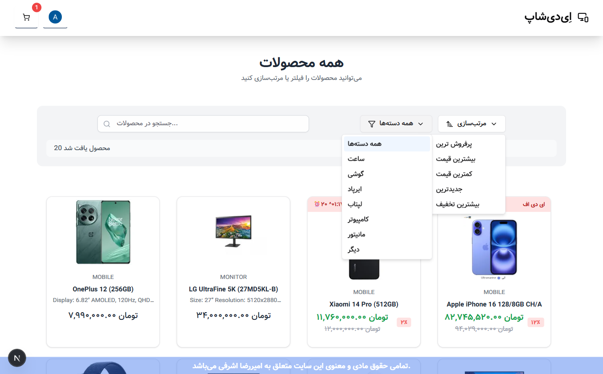

# 🛒 ADShop - Fullstack E-Commerce Platform
**Live Demo:** [https://adshop-main.vercel.app/](https://adshop-main.vercel.app/)
**ADShop** is a fully dynamic, responsive, and modern **Fullstack E-Commerce Platform** built with the latest web technologies.  
It provides a complete online shopping experience for customers and an advanced **Admin Dashboard** for managing every aspect of the store.

The platform includes:
- A **Responsive Storefront** with product search, filtering, and category-based browsing.
- A **Dedicated Blog Section** for articles, news, and promotions, with its own search and category system.
- A **Dynamic Products Page** where customers can explore detailed product information.
- A **Powerful Admin Dashboard** with full CRUD operations for products, orders, users, and blog posts.

### 🚀 Key Features
- **Fully Dynamic Content** – All data is stored in a PostgreSQL database and fetched dynamically via Prisma.
- **Authentication & Authorization** – Secure user login, registration, and role-based access using Clerk.
- **Image Uploading** – Integrated media upload for products and blog posts.
- **Responsive Design** – Optimized for mobile, tablet, and desktop using Tailwind CSS.
- **Reusable Components** – Built with ShadCN UI for consistent and accessible UI elements.
- **SEO Friendly** – Optimized meta tags, structured data, and clean URLs.

---

## 📍 Frontend Routes & Roles

| URL Path      | Role / Purpose |
|---------------|----------------|
| `/`           | **Homepage** – Displays featured products, latest blog posts, and promotional banners. |
| `/products`   | **Product Listing** – Shows all products with search, filters, and category browsing. |
| `/blog`       | **Blog Page** – Lists all blog posts with search and category filtering. |

---

## 📍 Dashboard Routes & Roles

| URL Path               | Role / Purpose |
|------------------------|----------------|
| `/dashboard/original`  | **Main Dashboard Overview** – Displays statistics, sales charts, recent orders, and insights. |
| `/dashboard/users`     | **User Management** – Manage registered users with search, filters, and CRUD actions. |
| `/dashboard/blog`      | **Blog Management** – Add, edit, delete posts, and manage blog categories. |
| `/dashboard/products`  | **Product Management** – Create, edit, delete products, manage categories, and upload images. |
| `/dashboard/orders`    | **Order Management** – View, track, and update customer orders. |

---

## 🛠️ Tech Stack

This project is built using modern and fully integrated technologies:

- **Frontend:** [Next.js](https://nextjs.org/) (App Router) + [React](https://react.dev/)  
- **Styling & UI:** [Tailwind CSS](https://tailwindcss.com/), [ShadCN UI](https://ui.shadcn.com/), [Radix UI](https://www.radix-ui.com/), [Lucide React](https://lucide.dev/)  
- **Forms & Validation:** [React Hook Form](https://react-hook-form.com/), [Zod](https://zod.dev/)  
- **State & Data Fetching:** [TanStack Query](https://tanstack.com/query/latest), [TanStack Table](https://tanstack.com/table/latest)  
- **Backend & Database:** Next.js API Routes, [Prisma ORM](https://www.prisma.io/), PostgreSQL  
- **Authentication:** [Clerk](https://clerk.com/) (user management, roles, and authentication)  
- **File Uploads:** [Cloudinary](https://cloudinary.com/) (product and blog image storage & management)  
- **Charts & Analytics:** [Recharts](https://recharts.org/)  
- **Hosting:** [Vercel](https://vercel.com/) (frontend, backend, and database hosting)  

> This setup ensures the frontend, backend, database, and authentication are all integrated in a single high-performance and secure environment.


---

### 🏪 Store (Frontend)
- Fully responsive design (mobile, tablet, desktop)
- Home page for the store
- Products page with search and filtering
- Blog page with its own search
- Product details page with add-to-cart functionality
- User authentication with **Clerk**
- Real database connection for products and blog posts

### 📊 Admin Dashboard
- **Main Dashboard Page:** Displays sales charts, total orders, total users, last 5 customers, total products, and revenue
- **User Management:** Change roles (Admin/User), ban or delete users
- **Order Management:** Order number, date, customer name, email, products, total amount, and order status
- **Blog Management:** Add, edit, delete blogs with image management
- **Product Management:** Add, edit, delete products with image management
- Image uploads with **Cloudinary**
- Discount system with countdown timer (fully manageable from the admin panel)

---

## 🚀 Installation & Setup

Follow these steps to run the project locally:
1. **Clone the repository**
   ```bash
   git clone https://github.com/your-username/adshop.git
   cd adshop
  ```
2. **install dependencies**
    ```bash
    pnpm install
    ```
3. **Set up environment variables**
Create a .env file in the root directory and add the following:
```env

This project uses the following environment variables.  
The values are stored securely and should be added to your `.env` file before running the project.


DATABASE_PRISMA_DATABASE_URL=prisma+postgres://...
DATABASE_DATABASE_URL=postgres://...
DATABASE_POSTGRES_URL=postgres://...
DATABASE_URL=${DATABASE_PRISMA_DATABASE_URL}

CLERK_SECRET_KEY=your-clerk-secret
NEXT_PUBLIC_CLERK_FRONTEND_API=your-clerk-frontend-api
NEXT_PUBLIC_CLERK_PUBLISHABLE_KEY=your-clerk-publishable-key
NEXT_PUBLIC_CLERK_SHOW_DEV_BANNER=true
NEXT_PUBLIC_CLERK_SIGN_IN_URL=/sign-in
NEXT_PUBLIC_CLERK_SIGN_UP_URL=/sign-up
NEXT_PUBLIC_CLERK_SIGN_IN_FALLBACK_REDIRECT_URL=/
NEXT_PUBLIC_CLERK_SIGN_UP_FALLBACK_REDIRECT_URL=/

BASE_URL=http://localhost:3000

CLOUDINARY_CLOUD_NAME=your-cloud-name
CLOUDINARY_API_KEY=your-cloudinary-api-key
CLOUDINARY_API_SECRET=your-cloudinary-api-secret
```
4. **Run database migrations**
    ```bash
    pnpm prisma migrate dev
    ```
5. **Start the development server**
    ```bash
    pnpm dev
    ```
6. **Open the app in your browser**
    ```
    http://localhost:3000
    ```
    

## 📸 Screenshots

| Store Home Page         | Dashboard Overview         |
|------------------------|---------------------------|
|  |  |

| Products Listing       | Single Product Page       |
|-----------------------|---------------------------|
|  |  |

| Product Management    | Blog Page                 |
|----------------------|---------------------------|
|  |  |

| Discount Page         | Blog Management           |
|----------------------|---------------------------|
|  |  |

| User Management       | Order Management          |
|----------------------|---------------------------|
|  |  |

| Dashboard Menu        |                           |
|----------------------|---------------------------|
|  |                           |
